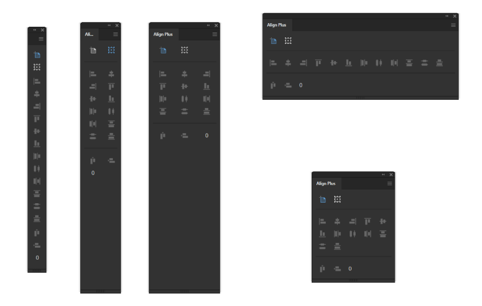

# Align Plus

Rebuild of Align panel to add responsive UI and additional features

> Not ready for production. Need to manually rebuild all Alignment functions since Actions don't retain Align To information, will reference Smart Align or update gehenna to make this easier.

## Installation and use

- [Download the ZXP by clicking here](https://github.com/Inventsable/Align-Plus/raw/master/archive/Align-Plus_1.0.0.zxp)
- Use a valid ZXP installer (like [ZXPInstaller](https://zxpinstaller.com/) or [Anastasiy's Extension Manager](https://install.anastasiy.com/)) and open the ZXP
- Relaunch Illustrator and find in Windows > Extensions > Pathfinder Plus

---

## Context Menu

- `Show Annotation` - Displays the name of the operation as you hover over buttons
- `Responsive UI` - Buttons will become disabled unless at least two objects are selected
- `Retain Selection` - Combs through the document after each operation to ensure result is still selected, adds additional overhead that might make the panel slower on very large documents
- `Refresh Panel` - Reloads the extension
- `Copy debug URL` - Copies localhost URL of panel debugging port to clipboard which can access Chrome DevTools on the extension via the [CEFClient program found here](https://github.com/Adobe-CEP/CEP-Resources/tree/master/CEP_9.x)
